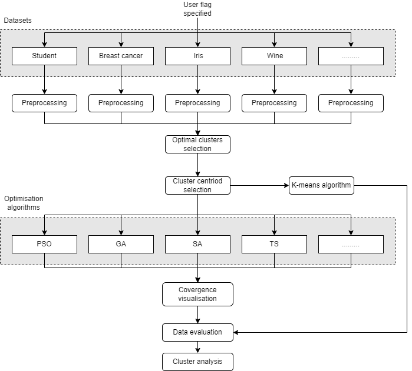

# Optimization Assignments

**Why not open-source it, right?**

## How It Works

The main objective of this project is to create optimization algorithms from scratch to effectively cluster data and compare the results against a K-Means clustering approach. The current code uses the Calinski-Harabasz Index as the objective function, meaning the algorithms aim to maximize this clustering evaluation metric. Currently, the code supports only this objective function, but future updates could potentially include support for other objective functions upon request.

Below is an architecture diagram illustrating the modular structure of the code. This design allows developers to easily integrate new datasets and optimization algorithms into the framework for further testing.



## Getting Started

### Installation

First, install the required dependencies by running:

```bash
pip install -r requirements.txt
```

### Running the Code

To execute the code, specify the dataset and the optimization algorithm using the `--dataset` and `--optimization` flags in the terminal.

**Available datasets:**
- `students`
- `wine`
- `iris`
- `breast_cancer`

**Available optimization algorithms:**
- `PSO` (Particle Swarm Optimization)
- `GA` (Genetic Algorithm)
- `SA` (Simulated Annealing)
- `TS` (Tabu Search)

Here is an example of how to run the source code:

```bash
python src/main.py --dataset students --optimization PSO
```

To automate the process and run all combinations, execute the following command in the bash terminal:

```bash
./run_all.sh
```

This will run all combinations of clustering optimization algorithms on the datasets. The results, including visualized plots, will be stored in the `cluster_data` folder. Within this folder, you can browse and view the files generated by the codebase. The naming convention includes the algorithm used and the dataset name to help you easily locate specific results.

### Generating Reports

To generate reports on the data, run the following command:

```bash
python cluster_data/generate_report.py
```

This will create a combined CSV file containing all the data and will also generate a PDF report that combines all the images.

Afterwards, you can process the combined CSV file to create separate tables where each optimization algorithm is compared against the others on specified clustering evaluation metrics. Run the following command:

```bash
python cluster_data/table_processing.py
```
